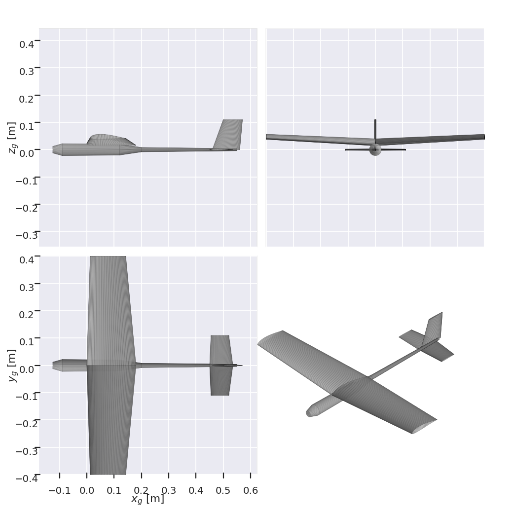

# RC Plane Design

## Summary


Aerodynamic design, mass/CG budget, and rib export for a sub-250 g, ESP32-S3-controlled, 3D-printed (Markforged Onyx rib + carbon spar + film) trainer. Built on [AeroSandbox](https://github.com/peterdsharpe/AeroSandbox) with NeuralFoil for low-Reynolds airfoil data.

**Wing airfoil: SD7062** (decided). `task airfoils` is kept for comparing against alternatives.

Everything is driven by `src/planedesign/config.py`: geometry, airfoils, and every component's mass and position.

## Setup
This project uses [uv](https://docs.astral.sh/uv/) and [go-task](https://taskfile.dev/).
1. install `uv` and `task`
2. `git clone https://github.com/Tsmorz/rc-plane-design.git`
3. `task init` to create the virtual environment and install the pre-commit hooks

## Running
Edit `config.py`, then:
```bash
task airfoils                    # candidate airfoils at your real Re
task analyze                     # mass budget, CG, static margin, trim, power
task analyze -- --solve-cg       # place the battery for the target static margin
task ribs                        # per-rib outlines + spar holes -> outputs/ribs/
task budget                      # mass + power budget -> docs/budget.md
task cad                         # printable ribs, print plate, assembly -> outputs/cad/
task test                        # guardrails: mass limit, static margin, stall speed, straight spar
```
Outputs (plots, rib CSVs) land in `outputs/` (git-ignored).

## Layout
```
src/planedesign/
  config.py     design parameters + mass items (edit this)
  geometry.py   config -> asb.Airplane (wing, tail, fin, pod/boom)
  mass.py       mass budget, CG, battery-position solver, what-if helpers
  analysis.py   neutral point, static margin, trim via asb.Opti, stall, power/flight time
  airfoils.py   NeuralFoil polars and summaries
  ribs.py       rib stations in each rib's flat 2D frame, CSV export
  budget.py     mass (planned vs measured) and power budget, markdown snapshot
  cad.py        CadQuery rib generator: square spar hole, LE slot, truss lightening
scripts/        airfoil comparison, design analysis, rib export
tests/          design guardrails
docs/           images used in this README
```

## Budget
Edit `src/planedesign/config.py`: set `measured_g` on a component once it is weighed, and update
`power_items` as you measure real current draw. `task budget` prints both budgets and rewrites
[docs/budget.md](docs/budget.md); commit it to keep a history as the build progresses. The power
figures shipped in the config are estimates and the battery C rating is a placeholder.

## CAD export
`task cad` needs the optional CadQuery extra (`uv sync --extra cad`) and writes to `outputs/cad/`:
- `wing_half_assembly.step`: ribs at their span stations, twisted about the spar, plus the spar tube. Import into **Onshape**.
- `print_plate_NN.step` (and `.stl`): ribs packed onto one or more plates, each sized to fit inside your
  printer's bed (`Design.printer` in `config.py`: `bed_width_mm` / `bed_depth_mm` / `bed_height_mm`). Ribs are
  packed shelf-style and a plate rolls over to a new one once it runs out of depth, so a small bed just means
  more plates, not a failed export. Drag each plate's STEP straight into **Eiger** (it imports native STEP;
  the STL is a fallback) and set the material to Onyx.
- `rib_XX.step` / `.stl`: individual ribs.
- `fuselage_pod.step` / `.stl`: the nose pod only — a loft through `fuselage_stations` up to `Design.pod_end_x`
  (default 200 mm aft of the wing LE). Aft of that, the fuselage is a straight, constant-diameter carbon tube
  boom running to the tail mount: stock tube, cut to length, not printed or exported. `task cad` prints the
  length and OD to cut (`Design.boom_od_mm`); tune `pod_end_x` if you want more or less of the nose printed.
- `htail.step` / `.stl`, `elevator.step` / `.stl`, `vtail.step` / `.stl`: the tail surfaces as **airfoil solids**
  (the `Design.htail` / `Design.vtail` airfoil, NACA 0006, lofted root to tip with the config planform). The
  trailing edge is thickened to `Design.printer.tail_te_mm` so it prints. The stabilizer and elevator are separate
  solids with `hinge_gap_mm` between them (tape/film hinge). **These are solid outer molds and heavy in plastic
  (the tail set is about 90 cm^3, roughly 110 g of Onyx).** The 11 g tail budget assumes foam or a hollow/foaming
  print, so use them as a foam-core template or print in a lightweight mode, then weigh and set `measured_g`.
- `aileron_rib_NN.step` / `.stl`: the aft piece of each rib inside the aileron span, with its own carbon-rod nose
  notch and truss. The fixed rib stops at the hinge line, so the film hinge crosses the gap. The two ribs at the
  ends of the aileron span stay whole as closeouts (slit the film beside them).

- `full_aircraft_assembly.step`: both wing halves, the pod, the boom (as a plain tube), and both tail
  surfaces, positioned from `config.py`, in one file. Open it in **FreeCAD** (`brew install --cask freecad`,
  free) to eyeball the whole plane locally — File > Open, no import step needed, STEP support is built in.

Rib features and printer limits (thickness, spar width, minimum web, truss) live in `RibSpec` in `config.py`.
The spar is a **square carbon tube**. Each rib's square hole is rotated by that rib's twist, so sliding the ribs
onto the straight tube sets incidence and washout, and they cannot rotate about it. Set the spanwise spacing
with marks or spacers at the rib pitch.

## Control surfaces
Defined by `ControlSurfaceSpec` in `config.py` and attached to `Design.wing` (aileron: 28 % chord, outboard half
span, differential) and `Design.htail` (elevator: 35 % chord, full span). AeroSandbox, the analysis and the CAD all
read the same numbers. Keep the aileron span ends on rib stations (a test checks this). There is no rudder: this is
a 3-channel plane (aileron, elevator, throttle), matching the servos in the budget.

## Reading the results

- **Static margin**: aim for 12-20 % MAC on a trainer. Below 5 % is twitchy or unstable; above 25 % is
  nose-heavy. Rather than adding ballast, fix it with `--solve-cg` (moves the battery).
- **Tail incidence**: `trim()` solves stab incidence and alpha for L = W and Cm = 0. Build the stab at
  the value for your cruise speed; the spread across speeds is what the elevator must supply.
- **Control authority**: `task analyze` prints the elevator deflection needed to trim each speed with the stab
  fixed, and the steady-state aileron roll rate. Tests guard both (elevator < 60 % of travel, roll rate
  60-360 deg/s). The roll rate is an upper bound (no adverse yaw) and flattens near stall as the tip stalls.
- **Flight time**: "ideal" is steady level flight on a perfect surface. "Real" applies
  `real_world_power_factor` (default 2.5x). Trust the real column, then calibrate the factor from
  your first flight logs.
- **NeuralFoil confidence** below ~0.9 means that polar is extrapolated; don't choose an airfoil on it.

## Caveats

AeroBuildup is a fast, differentiable buildup method, not CFD. It is good for trends, sizing, CG and
trim, but it does not capture film scalloping between ribs, laminar-bubble details, or propwash. Verify
with ballasted glide tests before the first powered flight, and treat logged flight data as the truth.

## Next steps

- Feed measured part masses back into `config.py` as you build (use a 0.1 g scale).

## Adding to the repo
1. When wanting to make new changes, please create a new branch first:\
`git checkout -b new-branch-name`

2. While making changes in your new branch, keep track of changes with:\
`git add file_that_changed`\
`git commit -m "a useful message"`\
`git push`

3. With new functionality, please create new unit and integration tests to make development easier in the future. Your tests should be added to the `tests` directory.
Tests should be run with: `task test`
